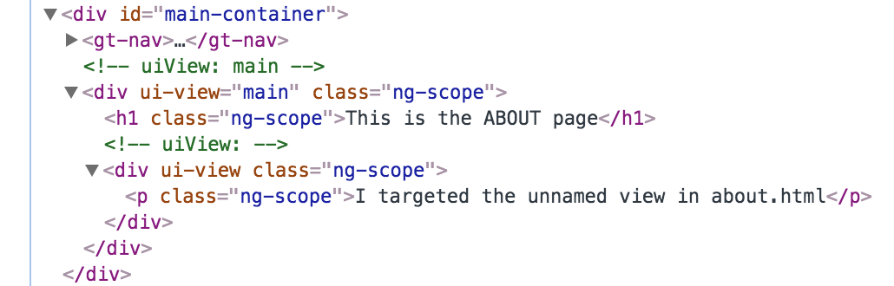

# Angular - Services, Directives, & UI Router

We will discuss some more components of Angular.

1. Services
2. Directives
3. Routing
4. A quick sidenote on dependency injection


## Services

Services are JS objects that are able to be shared throughout your Angular app using **dependency injection**.  Services are designed to provide functionality for parts of your application.  Angular has several built-in services, such as `$http`, `$routeProvider`, and `$scope`.  Notice they all start with `$`. Custom services should **NOT** start with a `$`.  All Angular services are *singletons*, meaning each service is instantiated only once, and everytime it is used, the singleton is being referenced.  You can think of services as a means of holding functions that you want to be able to use throughout your Angular app. 

We will create a service which will have a method that will send a GET request:

```javascript
// app/articles/article.service.js

angular.module('app.factory.articles', [])

.service('serviceHttp', function($http){
    this.getArticles = function(){
        return $http.get('http://localhost:8080/articles')
        .then(
            function(result){ return result },
            function() { alert("Error: No data returned") }
        );
    }
});
```

We must also include the script in our index.html:

```html
<script src="app/articles/article.service.js" charset="utf-8"></script>
```

From here, we can now inject our service into our controller and then we can use the `getArticles()` function!

```javascript
var TestApp = angular.module("TestApp", ["app.service.articles"])

.controller('MainCtrl', function($scope, $state, $http, serviceHttp){
    serviceHttp.getArticles().then(function(result){
        $scope.articles = result.data;
    })
});
```

This will run `serviceHttp.getArticles()` as soon as the controller is created and then, upon success, will attach the data to our `$scope`.

### Service vs. Factory

The differences between **services** and **factories** are often a confusing part of Angular for new devs to wrap their heads around. First thing to remember is that they all provide a very similar utility - they allow us to share functions across our app. The main difference is in what manner they share those functions and how they are constructed.

- **Service** - We attach properties to it using `this`, just as we would when building a constructor. Angular creates an instance of the service at runtime.
- **Factory** - These return an object in which we attach properties and methods.  

For more info on this subject, check out [this StackOverflow thread](http://stackoverflow.com/questions/15666048/angularjs-service-vs-provider-vs-factory).

#### If we wanted to do the same thing, but with a factory...

```javascript
angular.module('app.factory.articles', [])

.factory('factoryHttp', function($http){
    var factoryObj = {
        getArticles: function(){
            var data = $http.get('http://localhost:8080/articles')
            .then(function(result){ return result },
                  function(err) { alert("Error: No data returned") }
            );
            return data;
        }
    };

    return factoryObj;
}]);
```

Notice that we are creating an object, and then assigning it a method. We then return that object and have access to all of its properties (in this case, the `getArticles()` function). Both `serviceHttp` and `factoryHttp` do the same thing, they allow us to use the `getArticles()` function.

## Directives

Directives are one of the main features that makes Angular so powerful. It allows us to insert logic in the form of a custom HTML element.  Think of directives as a custom HTML element that you define and then inject anywhere into the DOM, and you can also give it a controller to perform operations.

Angular has many [built-in directives](http://www.w3schools.com/angular/angular_ref_directives.asp).  Examples include `ng-app`, `ng-click`, and `ng-repeat`.

#### Creating a Custom Directive

For this example, we will create a directive for our navigation bar. The template looks like this:

```html
// app/nav/nav.html

<nav>
    <ul>
        <li><a ng-click="showClick($event)" href="http://localhost:8080/home">Home</a></li>
        <li><a ng-click="showClick($event)" href="http://localhost:8080/about">About</a></li>
    </ul>
</nav>
```

We are giving the `<li>` tags a function called `showClick()` to perform on a click event and passing in the `$event` object. `$event` is an instance of an event object, which we can use in our controller to get information about the click event.

This is how we define our directive:

```javascript
// app/nav/nav.directive.js

angular.module('app.nav', [])

.directive('gtNav', function(){
    return {
        templateUrl: 'app/nav/nav.html',
        restrict: 'E',
        controller: function($scope){
            $scope.showClick = function(e){
                console.log(e.currentTarget);
            }
        }
    }
});

```

Note that when naming your directive, it *must* be written in **camelCase**.  When you inject it into the DOM, you must write it in **train-case**. Angular does all the magic parsing for you.

The `restrict` property tells Angular which method you will use to invoke your directive (see below).  We create a new controller, and define the `showClick()` function which logs the current target of the event.  If you wanted to inject any dependencies, you would do so as you normally would in the parameters of the function.

Now, we must include it in our master app module:

```javascript
var TestApp = angular.module("TestApp", ["app.service.articles", "app.nav"])
```

…as well as in our index.html:

```html
<script src="app/nav/nav.directive.js"></script>
```

OK! Finally, we must invoke the directive in our view.  There are 4 ways to invoke a directive:

```html
// custom element (generally the most popular method), restrict: 'E'
<gt-nav></gt-nav>

// attribute, restrict: 'A'
<div gt-nav></div>

// class, restrict: 'C'
<div class="gt-nav"></div>

// comment, restrict: 'M'
<!-- directive: gt-nav -->
```

When our directive is rendered, the HTML looks like the following:


## Routing

Angular 1.5 has two different options for routers: **ng-Route** and **UI Router**.  We will be using UI Router.

## ui.router

UI Router uses states and associates them with URLS, views, templates, controllers, etc. It is slightly more complex than ng-Route, but it is much more powerful because you can load multiple views for each state. Think of each state as a "page" of your SPA.

### The Set-Up

We inject `$stateProvider` which lets us configure our UI Router.  We give the state a name, associate it with a URL, and designate the views that we want to render at the state.

```javascript
// app/routes.js

angular.module('app.routes', ['ui.router'])

  .config(function($stateProvider){
      $stateProvider
          .state('home',{
              url: '/',
              views: {
                  'main': {
                      templateUrl: 'app/views/main.html'
                  }
              }
          })

          .state('about',{
              url: '/about',
              views: {
                  'main': {
                      templateUrl: 'app/views/about.html'
                  },
                  '@about': {
                      template: '<p>I targeted the unnamed view in about.html</p>'
                  }
              }
          });
  });
```

The about.html template looks like this: 

```html
<!-- app/views/about.html -->

<h1>This is the ABOUT page</h1>
<div ui-view></div> 
```

The `@` in our view name allows us to use **absolute naming**. Citing the [UI Router github page](https://github.com/angular-ui/ui-router/wiki/Multiple-Named-Views#view-names---relative-vs-absolute-names):

>  Behind the scenes, every view gets assigned an absolute name that follows a scheme of `viewname@statename`, where viewname is the name used in the view directive and state name is the state's absolute name.

Because we didn't name the `ui-view` in about.html, writing `@about` specifically targets the unnamed ui-view of its parent (the about state). It will then load the template inside of the `ui-view`.

Don't forget to include UI Router and the routes file we've created into our list of dependencies. Angular 1.5 does not come with UI Router built-in.  You must include a link to it in your scripts.

```html
<!-- app/views/index.html -->

<script src="https://cdnjs.cloudflare.com/ajax/libs/angular.js/1.5.8/angular.min.js"></script>
<script src="https://cdnjs.cloudflare.com/ajax/libs/angular-ui-router/0.3.2/angular-ui-router.min.js"></script>
<script src="app/nav/nav.directive.js"></script>
<script src="app/app.js"></script>
<script src="app/routes.js"></script>
```

We must also include the main ui-view directive into our ` index.html` file so that Angular knows where to load our views & templates.

```html
<!-- app/views/index.html -->

<div id="main-container">
	<gt-nav></gt-nav>
	<div ui-view="main"></div>
</div>
```

In order to be able to link to these states inside of our web app, we need to utilize `ui-sref`. This is a directive that will load the *href* property for us, along with some other angular magic.

```html
<!-- app/views/templates/nav.html -->

<nav>
    <ul>
        <li><a ng-click="showClick($event)" ui-sref="home">Home</a></li>
        <li><a ng-click="showClick($event)" ui-sref="about">About</a></li>
    </ul>
</nav>
```

So, when we click on the link for *about*, our browser will navigate to the URL "localhost:8080/about", and the **about** state will be loaded.

Last but not least, we must inject our routes module into our angular app.

```javascript
var TestApp = angular.module("TestApp", ["app.routes", "app.nav", "app.factory.articles"])
```

When we navigate to `/about`, the HTML will render as the following:



## A quick sidenote on dependency injection

In production level apps, it is very likely that you will *minify* your code.  Because of the nature of dependency injection in Angular this causes issues, specifically the renaming of your dependencies. The way around this is actually pretty simple - Angular allows you to use string literals in an array. Quoting [this article](http://anandmanisankar.com/posts/angularjs-dependency-injection-demystified/):

> In this approach, instead of just providing a controller function, we pass an array whose elements consist of a list of names of the dependencies followed by the function itself. This overcomes the issues caused with minified JavaScript, by allowing flexible parameter names.

We do this in our factory example above:

```javascript
.factory('serviceHttp', ['$http', 'myOtherModule', function($http, myOtherModule){
    var factory = {
        getArticles: function(){ /* code here */  }
    };
     
    return factory;
}]);
```