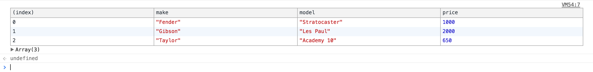

# Debugging Tools

### console.table

You can use this to display your objects in a table format

```javascript
var guitars = [
    { make: 'Fender', model: 'Stratocaster', price: 1000 },
    { make: 'Gibson', model: 'Les Paul', price: 2000 },
    { make: 'Taylor', model: 'Academy 10', price: 650 }
];
 
console.table(guitars);
```



## Chrome inspector history

You can quickly access the last 5 elements you've inspected in with dev tools.  All you have to type is `$0` for the most recently selected element, `$1` for the next most recent element, `$2`, and so on.

NEED SCREENSHOT!!!!

## Further Reading

- [15 Debugging](https://raygun.com/javascript-debugging-tips?utm_source=cooperpress&utm_medium=primary&utm_campaign=cooperpress-javascript)