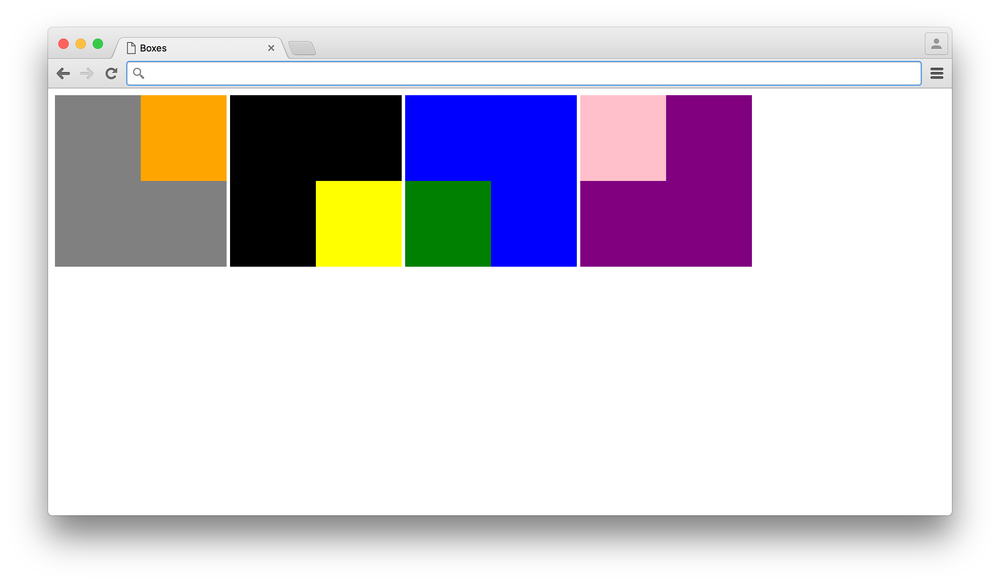

# CSS Grid

In the early days of the web, before CSS existed, it was common to use `<table>` elements to build layouts. It was really the only way to get content to go precisely where you wanted it to go. After popular browsers gained support for CSS, using `<table>` elements in this way became widely frowned upon for several reasons. One is that it violates principles of [semantic markup](../semantic_markup). If you are using `<table>` elements for layout, you are putting all kinds of content in  `<table>` tags when the only type of content that belongs there is tabular data, such as bus schedules or tax brackets. Another reason using `<table>` elements for layouts became uncool is that it runs against a core idea of CSS. CSS aims to separate from content the description of how it is supposed to look. If you are using `<table>` elements to place content on your page then you are mixing up your content and your layout information. Also, a `<table>` tends to involve a lot of markup and provides a lot of opportunity to accidentally do something invalid. 

So the use of `<table>` declined dramatically while the use of `<div>` went through the roof. Yet a desire to use `<table>`, or something like it, lingered. Many quite common layouts are difficult to achieve using absolute or relative positioning, left and right floats, margin, padding, etc. while they are relatively easy using `<table>` elements. Also, as a visual survey of websites will make clear, it is extremely common for web pages to be laid out in a grid. So it makes sense to describe their layouts as grids.

For a long time it has been possible to use tables without using `<table>` elements - by setting a non-`<table>` element's `display` property to `table`, `table-cell`, etc., and thereby avoid some of the issues that led to `<table>` falling out of favor. But now we have [CSS Grid Layout](https://developer.mozilla.org/en-US/docs/Web/CSS/CSS_Grid_Layout) - a brand new way to describe a grid layout in CSS that addresses all the concerns with the older techniques and even allows you to do some things that were never possible with `<table>` elements.

CSS Grid is so new that it is [not yet supported in all widely used browsers](http://www.caniuse.com/#feat=css-grid) but the day when it can be safely used in production will soon be upon us.

## Usage

CSS Grid works similarly to [Flexbox](../flexbox). To turn an element into a grid container, you set its `display` property to `grid`  or `inline-grid`. You can then add `grid-template-rows` and `grid-template-columns` properties to describe the rows and columns of the grid.

```css
#my-grid {
    display: grid;
    grid-template-rows: 100px 200px;
    grid-template-columns: 40% 1fr 2fr;
}
```

The example above creates a grid with two rows and three columns. The first row is 100 pixels tall and the second is 200 pixels tall. The first column takes up 40% of the available width. The second and third columns are specified with a new unit invented for CSS Grid - `fr`, which represent one part of the remaining space. Since the first column takes up 40%, the remaining space is 60%. Thus, `1fr` equals 20% and `2fr` represents 40%. This means that we could simply replace `40% 1fr 2fr` with `40% 20% 40%`. The `fr` unit is more useful when not dealing with percentages. If the first column were specified with pixels, we would not be able to say how much space is left over and using `fr` would be necessary for the other columns. 

If we added six child elements to this grid container, they would automatically occupy the six cells in the grid, filling them in the order in which they appear in the source. However, it is not required that we add six items. Consider the CSS for a single item presented below.

```css
#my-grid-item {
    grid-row: 2;
    grid-column: 1 / 3;
}
```

This single item would appear in the second row and span the first two columns. The first value in `grid-row` and `grid-column` specifies where in the grid the item should start. The second value, separated from the first with a `/`, indicates where the item should end. By setting the `grid-column` property to `1 / 3`, we are saying the item should start in the first column and go up to (but not into) the third. Thus it occupies the first two columns and the third column remains empty. Another way to achieve this same effect would be to use the word `span` to indicate how many columns should be spanned rather than the column at which the spanning should end.

```css
#my-grid-item {
    grid-row: 2;
    grid-column: 1 / span 2;
}
```

There are many more details to CSS Grid beyond these basics. A more thorough [introduction](https://developers.google.com/web/updates/2017/01/css-grid) is available at [developers.google.com](https://developers.google.com/web/updates/2017/01/css-grid) and it is recommended that you read through it and refer to it as the need arises.

## Exercises

1. [Grid Garden](https://cssgridgarden.com/) is a fun game that will help you master CSS Grid.

2. Create an HTML document with three elements in the `<body>` tag: a `<header>` element, a `<main>` element, and a `<footer>` element. The `<body>` should be have its `display` property set to `grid` and its `min-height` set to `100vh` so it fills the browser window. The `<header>` and `<footer>` elements should have solid backgrounds. Set new grid properties on the `<body>` element so that the `<header>` element is 70 pixels tall, the `<footer>` element is 30 pixels tall, and the `<main>` element fills the remaining space.

   

3. Use CSS Grid to reproduce the following design. Each outer box should be a grid container containing a single grid item.

   