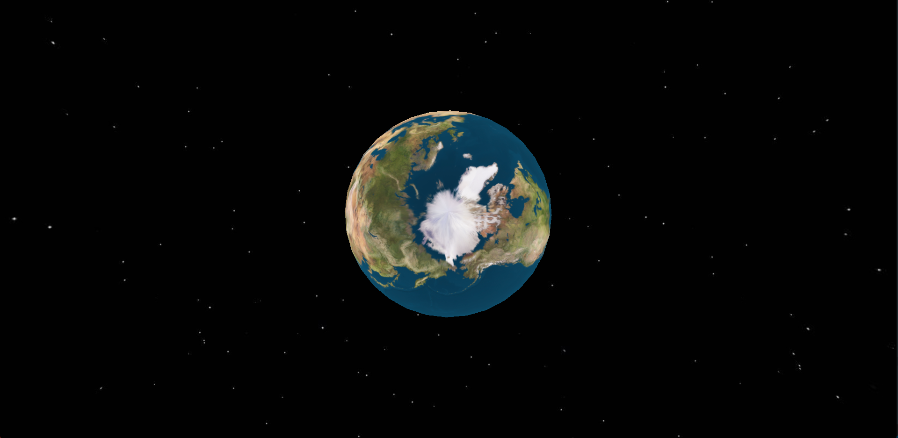
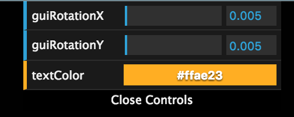

# Rendering 3D Graphics with Three.js


Three.js is a cross-browser JavaScript library/API used to create and display animated 3D computer graphics on a web browser. Three.js scripts may be used in conjunction with the HTML5 canvas element, SVG or [WebGL](https://en.wikipedia.org/wiki/WebGL).

You should definitely checkout the [Three.js website](https://threejs.org/) and look at some of the amazing examples.

## Creating a Scene

In order to get started creating anything with Three.js, we are going to need a few things:

1. **Scene** - the 3 dimensional space that you will be working with.
2. **Camera** - represents the user vantage point. There are several types of cameras in Three.js.
3. **Light** - our scene needs a light source, otherwise everything will be "dark" and you won't be able to see anything.
4. **Mesh** - a mesh is a 3D object we create. This can be a cube, planet, character, tree, literally anything!
5. **Controls** - how the user can interact with the scene.
6. **Renderer** - the function which renders our scene.

## Let's create a new Planet Earth!

Ok let's get started! Our HTML will be very simple. Notice we are loading Three.js via a CDN:

```html
<!DOCTYPE html>
<html>
	<head>
		<meta charset=utf-8>
		<title>Planet Earth</title>
		<style>
			body { margin: 0; }
			canvas { width: 100%; height: 100% }
		</style>
	</head>
	<body>
		<script src="https://cdnjs.cloudflare.com/ajax/libs/three.js/85/three.min.js"></script>
     	 	<script src="/path/to/script.js"></script>
	</body>
</html>
```

### Scene

Let's create our scene:

```javascript
var scene = new THREE.Scene()
var camera = new THREE.PerspectiveCamera(75, window.innerWidth / window.innerHeight, 0.1, 50)
camera.position.z = 30

var renderer = new THREE.WebGLRenderer()
renderer.setSize(window.innerWidth, window.innerHeight)
document.body.appendChild(renderer.domElement)
```

First we create a new scene.  Next, we create a *camera*.  Three.js has a few camera options. For this example, we will use the **PerspectiveCamera**, which is designed to mimic the way the human eye sees (things get smaller the further away they are, amongst other things).  The PerspectiveCamera constructor is created as follows:

`PerspectiveCamera(fov, aspect, near, far)`

These parameters make up the [viewing frustum](https://en.wikipedia.org/wiki/Viewing_frustum) of a camera. More info on this can be found in the [Three.js docs](https://threejs.org/docs/index.html#api/cameras/PerspectiveCamera).

The *renderer* is used to display our beautifully crafted scenes using WebGL.

### Lighting

In order to illuminate our scene, we need to add lights. Otherwise, we will not be able to see anything!  We will use **AmbientLight**, which creates a general light to illuminate all objects. As a result, this light will not cast any shadows because it does not have a direction.

```javascript
var light = new THREE.AmbientLight( 0xFFFFFF )
scene.add( light )
```

### The Mesh

Let's write the code to create our planet mesh.

```javascript
var geometry = new THREE.SphereGeometry( 10, 32, 32 )
var material = new THREE.MeshPhongMaterial()
material.map = new THREE.TextureLoader().load('/path/to/img/earthmap4k.jpg')
var earthMesh = new THREE.Mesh( geometry, material )

scene.add( earthMesh )
```

Most meshes in Three.js are made up of a geometry and a material. The *geometry* represents the skeletal structure of the mesh.  The *material* is the covering that goes over the geometry.  Think of the geometry as the skeleton and the material as the skin.

Three.js has several built-in geometries, including ConeGeometry, CircleGeometry, RingGeometry, PolyhedronGeometry, etc. We use the **SphereGeometry** because planet earth is a sphere.  The 3 arguments it takes are the radius, widthSegments, and heightSegments.  

From there we use the **PhongMaterial**, which is a special material that gives our mesh a shiny finish. Note there are plenty of other material options, check the [docs](https://threejs.org/docs/index.html) for a full list.  Using **TextureLoader**, we load a skin of planet earth and map that to our material.

In summary, we create a new geometry and material. We then use these to create a new mesh. Lastly, we add our earthMesh to our scene.

### OrbitControls

Three.js has several very cool control types offering various ways to interact with the scene.  Examples include *FirstPersonControls* (like a first-person shooter game) and *FlyControls* (fly around the scene like Superman).  We will use **OrbitControls**, which allows us to drag and move around the camera (not the planet!) as we *orbit* around our planet. These controls take the camera and element being rendered as arguments.

OrbitControls does not come baked into Three.js.  The separate files can be found in the [Three.js repo](https://github.com/mrdoob/three.js/tree/dev/examples/js/controls) (I've added OrbitControls to the `assets` folder of this repo).  We must include it in our project directory, then include the script in our index.html:

```html
<script src="/path/to/OrbitControls.js"></script>
```

Then we add to our script file:

```javascript
var orbit = new THREE.OrbitControls(camera, renderer.domElement)
orbit.enableZoom = false
```

### Render

Lastly, we must create a render function. Inside of the render function is where we can use *requestAnimationFrame* to animate our scene.  Notice we access the earthMesh's rotation property to make our sphere spin on its axes:

```javascript
var render = function() {
    requestAnimationFrame(render)
    earthMesh.rotation.x += 0.005
    earthMesh.rotation.y += 0.005
    renderer.render(scene, camera)
}
render()
```

### Adding a Skybox

Now we can see our planet earth rotating, but the background is black and boring.  Let's add a skybox.  Basically, a skybox is a BIG cube inside of which we place our meshes.  We give the *inside* of each side of the cube a texture.

```javascript
var imagePrefix = "/path/to/img/"
var urls = [ 'space.jpg', 'space.jpg', 'space.jpg', 'space.jpg', 'space.jpg', 'space.jpg' ]
var skyBox = new THREE.CubeTextureLoader().setPath(imagePrefix).load(urls)
scene.background = skyBox
```

With that, we now have our earth mesh rotating on its axes in outer space!



## Bonus: dat.GUI

dat.GUI is a lightweight graphical user interface for changing variables in JavaScript.  It plays very nicely with Three.js as it allows us to manipulate almost any value in our scene.  This is great for development.

We need to do some refactoring in order to get dat.GUI working.

First we need to include the file in our project, since it does not come natively inside of Three.js.

```html
<script src="https://cdnjs.cloudflare.com/ajax/libs/dat-gui/0.6.5/dat.gui.min.js"></script>
```

Now, we need to create a controls constructor. This constructor is where we set our initial values.

```javascript
var controls = new function() {
    this.textColor = 0xffae23
    this.guiRotationX = 0.005
    this.guiRotationY = 0.005
}
```

Next we must create a new instance of `dat.GUI()`, then we map the controls constructor property to the `gui` variable. 

```javascript
var gui = new dat.GUI()
gui.add(controls, 'guiRotationX', 0, .2)
gui.add(controls, 'guiRotationY', 0, .2)

gui.addColor(controls, 'textColor').onChange(function (e) {
    textMesh.material.color = new THREE.Color(e)
})
```

We also set a range for each control. For example, `guiRotationX` can be set to 0, all the up to .2, and everywhere in between those two values.

If we want to manipulate colors we set, we must take a slightly different approach.  We must chain an `onChange` method. Inside it, we map a specific mesh's color to the new color.

Inside of our render method, we must refactor our earthMesh rotations to the following:

```javascript
earthMesh.rotation.x += controls.guiRotationX
earthMesh.rotation.y += controls.guiRotationY
```

We should now see a control box on the top right of our window. We can now control the earthMesh's rotation as well as a mesh's color!



# Exercises

1. Following along with this lecture, create a planet earth of your own and use OrbitControls to control your scene.
2. Add a moon for our planet earth, as well as a planet mars, to our scene.  The materials for these meshes are included in the `assets` folder.  Place them at different coordinates within your scene.  Animate your scene so that the moon orbits around the earth.
3. Use the [TextGeometry](https://threejs.org/docs/index.html#api/geometries/TextGeometry) to add text to your 3D scene.  Don't forget to also create a material along with it to create your mesh.  The JSON file(s) you will need to load the fonts can be found [here](https://github.com/mrdoob/three.js/tree/dev/examples/fonts) (I've also added them to the `assets` directory of this repo to save you some time).

## Additional References

1. [Three.js Docs](https://threejs.org/docs/index.html)
2. [How to check if WebGL is supported on your device and/or browser](https://threejs.org/docs/index.html#manual/introduction/WebGL-compatibility-check)
3. [Planet textures](http://planetpixelemporium.com/)
